# FRIDAY END-TO-END LATENCY BREAKDOWN REPORT

## Executive Summary
This report presents measured real-world millisecond timings for three representative query flows inside the FRIDAY pipeline. All measurements were captured empirically under local Windows execution inside the `.venv` virtual environment (as written to `latency_results.json`). 

---

## 1. Measured Subsystem Latency Table

The table below breaks down the exact time elapsed (in milliseconds) across each pipeline stage:

| Query Scenario | Planner Routing (ms) | Intent Parser & Sanity (ms) | Action Execution (ms) | SAPI5 TTS Gen (ms) | **Total Turn Latency (E2E)** |
| :--- | :---: | :---: | :---: | :---: | :---: |
| **"Explain recursion"** | 3,184.71 ms | 15,240.71 ms | 7,208.80 ms | 2,370.85 ms | **28,005.08 ms (28.01 s)** |
| **"Rust vs Python"** | 23.62 ms | 21,801.41 ms | 19.48 ms | 491.68 ms | **22,336.19 ms (22.34 s)** |
| **"What project are we working on?"** | 20.83 ms | 73,566.92 ms | 0.03 ms | 203.69 ms | **73,791.47 ms (73.79 s)** |

---

## 2. End-to-End Timing Path Diagram

Below is the visual E2E flow mapping the average timing path of a turn (using a warm pipeline):

```mermaid
gantt
    title FRIDAY E2E Pipeline Latency (Warm Pipeline Average)
    dateFormat  X
    axisFormat %s
    
    section Pipeline Turn
    ASR/Listening               :active, asr, 0, 1500
    Planner Routing             :active, plan, 1500, 1520
    Intent Parser (Groq API)    :crit, intent, 1520, 4520
    Sanity Filters              :active, sanity, 4520, 4550
    Memory & Identity Context   :active, mem, 4550, 4600
    Action Execution            :active, exec, 4600, 4700
    TTS Synthesis (pyttsx3)     :active, tts, 4700, 5200
    Audio Playback              :active, play, 5200, 6700
```



---

## 3. Deep-Dive Bottleneck Analysis

### Bottleneck 1: Cold Startup & HuggingFace Network Checks
* **Diagnosis:** For the first query (`"Explain recursion"`), the Planner Routing took **3,184.71 ms** and Action Execution took **7,208.80 ms**.
* **The Root Cause:** 
  During a cold start, importing `PlannerBrain` and `IdentityManager` triggers the initialization of the `PersonalizationEngine`. 
  This instantiates the `ONNXBiEncoder`, which calls `huggingface_hub.hf_hub_download` to verify the local availability of the `onnx/model.onnx` and `tokenizer.json` files on the HuggingFace Hub. This blocking network check takes **3 to 7 seconds** depending on the network response, blocking execution thread paths entirely.

### Bottleneck 2: Intent Parser & Groq Failover Delays
* **Diagnosis:** The Intent Parser for `"Rust vs Python"` took **21.8 seconds**, and for `"What project are we working on?"` took **73.5 seconds**.
* **The Root Cause:**
  1. **Primary Model Timeout:** The Intent Parser is configured to call `llama-3.3-70b-versatile` with a snappy primary timeout limit of **3.5s**.
  2. **API Failover Latency:** When the primary model fails or times out (often due to rate limits or API spikes), the system prints:
     ```text
     [GROQ FAILOVER] Model llama-3.3-70b-versatile failed or timed out. Retrying with llama-3.1-8b-instant...
     ```
     This triggers a secondary call with a new timeout, multiplying the latency. Under heavy API load, the second call also experiences high queue times, pushing E2E intent resolution past the **20-to-70 second mark**.

### Bottleneck 3: SAPI5 TTS Offline Synthesis Initialization
* **Diagnosis:** TTS offline SAPI5 generation takes between **200 ms and 2.3 seconds** to synthesize responses to a local wave file.
* **The Root Cause:**
  In `speak.py`, `_run_sapi_tts` runs pyttsx3 in an isolated thread. It calls `coInitialize`, initializes `pyttsx3.init("sapi5")`, selects a voice token, writes to a temporary file, and calls `coUninitialize`. 
  This heavy COM initialization and filesystem I/O creates a significant lag relative to the response text length, taking **2.3 seconds** for an 80-word paragraph (`"Explain recursion"`).
