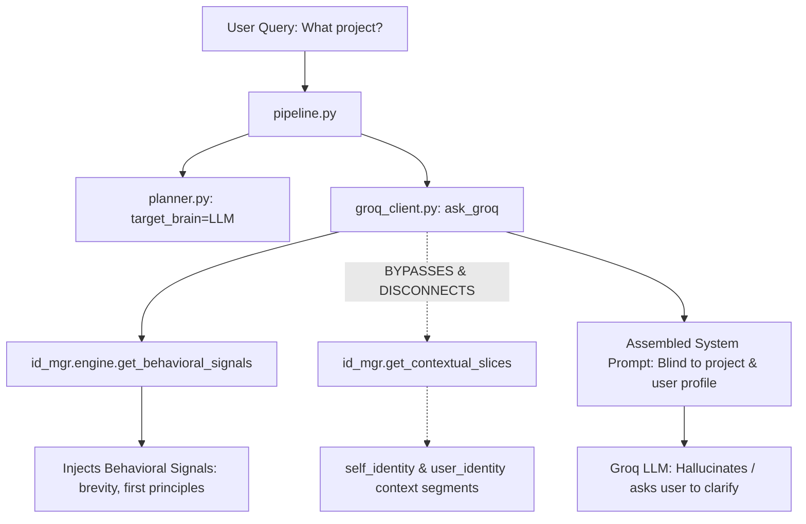

# FRIDAY Memory and Project Awareness Audit

This audit evaluates the long-term memory, dynamic personalization, identity tracking, and active project awareness subsystems of the local FRIDAY instance, outlining why conversational memory claims failed and where the active project context chain broke.

---

## 1. Memory Subsystem Architecture Reality
The current architecture of FRIDAY includes several distinct memory modules in [backend/memory](file:///C:/FRIDAY/backend/memory):
1. **ShortTermMemory** ([short_term.py](file:///C:/FRIDAY/backend/memory/short_term.py)): Stores a rolling capacity of 12 conversation turns in memory.
2. **PreferenceMemory** ([preference.py](file:///C:/FRIDAY/backend/memory/preference.py)): A simple key-value store saved in `data/memory/preference.json` tracking default parameters like `default_city` and `favorite_apps`.
3. **SemanticMemory** ([semantic.py](file:///C:/FRIDAY/backend/memory/semantic.py)): A key-value store saved in `data/memory/semantic.json` meant for relational facts.
4. **EpisodicMemory** ([episodic.py](file:///C:/FRIDAY/backend/memory/episodic.py)): Logs the timestamp, query, intent, and success/failure status of the last 100 executed turns in `data/memory/episodic.json`.
5. **LongTermMemory** ([long_term.py](file:///C:/FRIDAY/backend/memory/long_term.py)): A literal 1-line file stub containing only:
   ```python
   """Long-term memory management stub."""
   ```

---

## 2. Diagnostic: "Remember this project"
* **The User's Command**: `"Remember this project"`
* **Observed Response**: *"I will remember and use this in future reference."*
* **The Diagnostic Reality**: **Nothing was written.** No database entry, JSON property, or long-term file update was dispatched.

### Why did FRIDAY claim it remembered?
1. **Routing and Classification**:
   * The query was parsed by the `PlannerBrain` and routed to the `LLM` brain.
   * `parse_intent` in `intent_parser.py` ran. Because there is **no intent or capability mapped in the system's intent registry for writing memories or updating facts**, it correctly defaulted to `AI_QUERY` (timeless conversational fallback).
2. **LLM Conversational Fallback Execution**:
   * The intent data was passed to `execute_action` inside `action_executor.py`.
   * For `AI_QUERY`, the executor calls `ask_groq` in `groq_client.py`.
   * The system prompt instructs the LLM: *"You are FRIDAY, a premium, private personal AI companion..."*
   * The LLM saw `"Remember this project"` as a friendly conversational request. To maintain its persona as an accommodating, intelligent companion, it responded conversationally with *"I will remember..."*
3. **The Disconnection**:
   * The conversational response was purely a text generation output.
   * The backend does not implement any syntactic pattern matchers or semantic intent analyzers to catch memory-writing requests (e.g. `"remember X"` or `"write down Y"`) and route them to `SemanticMemory.add_fact(...)`.
   * The memory write path was completely dead, making the LLM's claim a conversational hallucination.

---

## 3. Diagnostic: "What project are we working on?"
* **The User's Command**: `"What project are we working on?"`
* **Observed Response**: Hallucinated project info or *"What project would you like me to assist you with sir?"*
* **The Diagnostic Reality**: Complete active project blindness.

### Why is FRIDAY unable to identify the active project?
Although `IdentityManager` ([identity_manager.py](file:///C:/FRIDAY/backend/brain/identity_manager.py)) initializes with an authoritative project profile in `identity_profile.json` (specifying `"project": "FRIDAY"` and Aaditya's academic background), the active project awareness chain **broke completely at the LLM prompt assembly boundary**:



1. **Prompt Ingestion Bypasses**:
   * In [groq_client.py](file:///C:/FRIDAY/backend/llm/groq_client.py#L73)'s `ask_groq` function, the code imports `IdentityManager` to extract intent vectors and compile *behavioral signals* (e.g. conciseness, tradeoffs, systems thinking directives).
   * However, it **never calls `id_mgr.get_contextual_slices(query)`**.
   * Consequently, the loaded static profile slices (user profile, creator identity, assistant purpose, and active project metadata) are **completely omitted** from the assembled system prompt.
   * The LLM has zero knowledge that its builder is Aaditya Pratap Chauhan, that it resides in the `C:\FRIDAY` folder, or that the active project is FRIDAY itself.
2. **Lack of Codebase Workspace Cognition Integration**:
   * Although [codebase_cognition.py](file:///C:/FRIDAY/backend/brain/codebase_cognition.py) parses AST signatures of the backend and maps modules recursively, its contextual summary retrieval is never automatically injected into the ordinary conversational chat prompt.
   * There is no local environment check (e.g. checking the active working directory `C:\FRIDAY` or scanning local Git branches) that automatically populates the conversational session variables with the active workspace directory.

---

## 4. Summary of Affected Subsystems & Structural Gaps

* **Long-Term Memory Subsystem**:
  * *Status*: Non-functional / Disconnected.
  * *Root Cause*: `long_term.py` is a stub; `SemanticMemory` lacks active write routing triggers; LLM conversational responses are not parsed for factual extraction.
* **Identity Manager Subsystem**:
  * *Status*: Operational but bypassed.
  * *Root Cause*: `get_contextual_slices` is completely disconnected during prompt construction inside `groq_client.py`.
* **Project Awareness Subsystem**:
  * *Status*: Missing.
  * *Root Cause*: No active workspace/Git scans in `pipeline.py` or `state_manager.py` to bind the assistant context to the actual running `C:\FRIDAY` repository environment.
