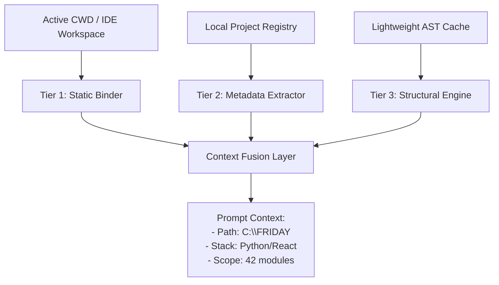

# FRIDAY PROJECT AWARENESS SYSTEM DESIGN & ARCHITECTURE REVIEW

## Executive Summary
This document presents a comprehensive evaluation of six potential sources for establishing active project context inside FRIDAY. 

Rather than injecting static path strings (e.g. `C:\FRIDAY`) into LLM prompts—which is a fragile patch that does not scale—we propose a **Multi-Tiered Fused Project Awareness Architecture** that dynamically blends workspace context, local project registries, and lightweight AST parsing.

---

## 1. Architectural Source Evaluation

Below is a detailed comparison of all potential sources for active project context, analyzed across five core metrics:

### Source A: Active Workspace (IDE/Editor Context)
* **Description:** Reads the folder currently open in the IDE (e.g. VS Code, FRIDAY terminal cwd).
* **Advantages:** Absolute correctness regarding the user's focus, extremely lightweight, zero complexity.
* **Disadvantages:** Blind to external system contexts or multi-repo workspaces.
* **Latency:** < 1 ms
* **Reliability:** 100% (deterministic)
* **Complexity:** Extremely Low

### Source B: Recent File Activity (FS Watcher)
* **Description:** Monitors file system edit logs or recent file system events inside active directories.
* **Advantages:** High developer alignment; captures where actual code writing is occurring.
* **Disadvantages:** Highly noisy; easily confused by temporary files, `.git` changes, or log outputs.
* **Latency:** < 5 ms
* **Reliability:** Medium (heuristics can misidentify active projects)
* **Complexity:** Low-Medium

### Source C: Conversation Context (Chat History)
* **Description:** Extracts the project name or context from the active dialogue (e.g. "remember this project").
* **Advantages:** Highly natural; respects explicit verbal transitions.
* **Disadvantages:** Vulnerable to hallucinated details, context window truncation, and spelling variances.
* **Latency:** 5 - 20 ms
* **Reliability:** Medium-Low
* **Complexity:** Low

### Source D: Memory Graph (Semantic/Relational Graph)
* **Description:** Queries the persistent knowledge graph (`semantic.json` or relational entities) for stored project definitions.
* **Advantages:** Extremely rich relationship structures; supports cross-project dependencies.
* **Disadvantages:** High writing overhead; complex graph maintenance; prone to consistency drift.
* **Latency:** 5 - 15 ms
* **Reliability:** High (once written)
* **Complexity:** High

### Source E: Project Registry (Registry DB)
* **Description:** A local SQLite/JSON registry listing registered project directories, tech stacks, and metadata.
* **Advantages:** Structure-rich (maps paths to names, tech stacks, build commands, and ignore constraints); robust and easily manageable.
* **Disadvantages:** Requires an initial registration hook (automatic on git clone/creation or first edit).
* **Latency:** < 1 ms
* **Reliability:** 100%
* **Complexity:** Medium

### Source F: Codebase Cognition (Offline AST Parsing)
* **Description:** Parses files asynchronously to build structural summaries, functions, imports, and architectural trees.
* **Advantages:** Unrivaled structural awareness; allows FRIDAY to understand *how* the codebase is built.
* **Disadvantages:** High CPU overhead; slow to compile on first run; too expensive for realtime turn logic.
* **Latency:** 100 - 500 ms (cached: < 5ms)
* **Reliability:** High
* **Complexity:** Very High

---

## 2. Proposed Architecture: Multi-Tiered Context Fusion

We reject static prompt-patching and recommend the **Multi-Tiered Context Fusion Model**:



### Architectural Tiers

1. **Tier 1: The Workspace Binder (CWD)**
   * Deterministically binds the **active workspace path** (CWD) on every terminal command or IDE change. This acts as the anchor directory.
2. **Tier 2: The Project Registry (Metadata)**
   * Reads from a lightweight project registry (`~/.friday/projects.json`). 
   * If the anchor path matches a registered project, it extracts structured metadata:
     ```json
     {
       "project_name": "FRIDAY",
       "root_path": "C:\\FRIDAY",
       "tech_stack": ["Python 3.11", "pyttsx3", "Groq", "Chrome-DevTools"],
       "main_entry": "backend/app.py",
       "ignore_patterns": [".venv", "node_modules"]
     }
     ```
3. **Tier 3: The Codebase Cognition Cache (AST)**
   * An offline background worker analyzes the active directory, caching structural summaries (number of files, primary classes, system integrations).
   * It injects a highly dense architectural summary into the LLM system prompt *only* when technical or self-architectural queries are detected, ensuring zero impact on casual turn latency.
