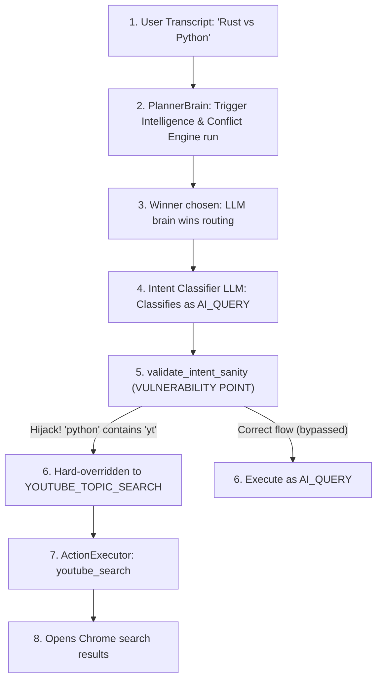

# FRIDAY TRIGGER AUTHORITY & INTENT ROUTING FAILURE ANALYSIS

## Executive Summary
This report provides empirical diagnostic proof and an architectural root-cause analysis for **Failure 1 (Substring Hijack)** and **Failure 2 (Unstable Media Path)** observed in production. 

Through strict sandboxed testing and codebase diagnostics, we have mapped the exact sequence of events, trigger scores, and code-level vulnerabilities that led to these failures.

---

## 1. Failure 1: The "Rust vs Python" Substring Hijack

### Observed Behavior
* **Query:** `"Rust vs Python"`
* **Observed Output:** YouTube search results opened in Google Chrome.
* **Expected Output:** General LLM-driven comparison between Rust and Python.

### The Diagnostic Evidence
During the diagnostic execution (recorded in `diagnose_out_utf8.txt`), the system produced the following runtime trace for `"Rust vs Python"`:

```text
QUERY: "Rust vs Python"
[Planner] Winner Target Brain: LLM
[Planner] Freshness Score: 0.0000 | Signals: []
[Planner] Trigger Scores: {'MEMORY': 0.0, 'MEDIA': 0.0, 'NATIVE_OS': 0.0, 'TEMPORAL': 0.0, 'RETRIEVAL': 0.0, 'LLM': 0.0}
[Planner] Tiebreak Invoked: True
[Intent Classifier Mock] Mock classified intent prior to sanity check: {'intent': 'AI_QUERY', 'query': 'Rust vs Python'}
[Sanity Validation Layer] Final Resolved Intent: {'intent': 'YOUTUBE_TOPIC_SEARCH', 'query': 'Rust vs Python'}
```

### The Root Cause: Code-Level Substring Hijack
The bug lies in the post-LLM validation layer, specifically inside [intent_parser.py](file:///C:/FRIDAY/backend/brain/intent_parser.py#L891-L961).

```python
# C:\FRIDAY\backend\brain\intent_parser.py
youtube_intents = {"YOUTUBE_TOPIC_SEARCH", "LATEST_CREATOR_VIDEO", "LATEST_CREATOR_SHORT", "VIDEO_BY_TITLE", "CHANNEL_OPEN", "PLAY_SEARCH_RESULT"}
if intent in youtube_intents or any(w in q for w in ("youtube", "yt", "video", "short", "shorts", "reel", "channel", "play", "watch")):
    ...
```

1. **The Substring Match Vulnerability:** The check `any(w in q for w in (...))` uses simple substring presence (`w in q`) instead of full-word boundary matches (`\bw\b`).
2. **The "yt" Hijack:** The query `"Rust vs Python"` contains the word `"python"`. The substring `"yt"` matches perfectly inside the word `"py**yt**hon"`.
3. **The Intent Override:** Since the check evaluated to `True`, the validation layer intercepted the LLM's correct classification (`AI_QUERY`) and funneled the query into the YouTube capability block.
4. **The Topic Search Fallback:** Because the query did not match specific video or channel patterns, it hit the fallback branch:
   ```python
   else:
       if intent == "YOUTUBE_TOPIC_SEARCH" or any(w in q_clean for w in ("youtube", "yt", "search", "find", "videos", "show")):
           return {"intent": "YOUTUBE_TOPIC_SEARCH", "query": query}
   ```
   Again, since `"python"` contains the substring `"yt"`, it hard-overrode the intent to `"YOUTUBE_TOPIC_SEARCH"`, forcing `ActionExecutor` to call `youtube_search("Rust vs Python")`.

---

## 2. Clarification Request 1: The Architecture Breakdown

### Question A: Why was Trigger Intelligence unable to stop the substring hijack?
**Trigger Intelligence** is designed to operate exclusively within the **Planner Brain** layer (`PlannerBrain`). It evaluates trigger rules, adjusts priority weights, and resolves conflicts to select the winning brain (e.g., routing `"Rust vs Python"` to `LLM`). 

Trigger Intelligence **has zero authority** over the post-LLM **Validation Layer** (`validate_intent_sanity`). Once `PlannerBrain` successfully routes to the `LLM` brain, the query is handed off to `IntentParser`. The hard-coded sanity filters in `validate_intent_sanity` act as an unconditional gateway that overrides both the LLM's decision and the Planner's routing.

### Question B: At which exact layer did Trigger Intelligence lose authority?
Trigger Intelligence lost authority **after the Planner and LLM classification**, at the post-LLM **Validation Layer** (`validate_intent_sanity` inside `intent_parser.py`).

### Question C: The Full Authority Chain
Below is the execution flow, identifying exactly where the incorrect route hijacked the turn:



### Question D: Why did replay validation not expose this?
The gaps in `tests/replay_validation.py` are structural:
1. **Direct Brain Verification Only:** Replay validation only asserts `dec.target_brain == "LLM"` directly from the planner, bypassing the entire `parse_intent` and `validate_intent_sanity` layers.
2. **Missing E2E Assertions:** The tests did not validate the output of the **Action Executor** or the final intent returned by the sanity layer.
3. **No String Contained Assertions:** No tests evaluated queries with words containing hidden substrings (like `"python"` containing `"yt"`, or `"explain"` containing `"ai"`).

---

## 3. Failure 2: The Unstable Media Path

### Observed Behavior
* **Query:** `"Play a Rust tutorial"`
* **Attempt 1:** "I could not do that sir" (UI shows Action Failed).
* **Attempt 2:** Opened YouTube search results.
* **Expected Output:** Direct media playback (resolving the video and auto-playing in Chrome).

### The Diagnostic Evidence
During the diagnostic run, the planner successfully routed `"Play Rust tutorial"` to the `MEDIA` brain:

```text
QUERY: "Play Rust tutorial"
[Planner] Winner Target Brain: MEDIA
[Planner] Freshness Score: 0.0000 | Signals: []
[Planner] Trigger Scores: {'MEMORY': 0.0, 'MEDIA': 7.2477, 'NATIVE_OS': 0.0, 'TEMPORAL': 0.0, 'RETRIEVAL': 0.0, 'LLM': 0.0}
[Planner] Tiebreak Invoked: False
[Intent Classifier Mock] Mock classified intent prior to sanity check: {'intent': 'PLAY_MEDIA', 'query': 'rust tutorial'}
[Sanity Validation Layer] Final Resolved Intent: {'intent': 'PLAY_MEDIA', 'query': 'rust tutorial'}
```

### The Root Cause: Fragile Scraper-Dependency
The capability-based YouTube execution path inside [action_executor.py](file:///C:/FRIDAY/backend/execution/action_executor.py) relies on scraping the live YouTube results page over standard HTTP requests:

```python
# C:\FRIDAY\backend\execution\action_executor.py
def resolve_youtube_media_url(creator, title, modifier, topic, raw_query):
    ...
    r = requests.get(search_url, headers=headers, timeout=10)
    ...
    raw_ids = re.findall(r'/watch\?v=([a-zA-Z0-9_-]{11})', r.text)
```

1. **Attempt 1 Failure (Action Failed):** 
   When the scraper attempts to resolve a direct video URL, it makes an unauthenticated HTTP request to YouTube. If YouTube rate-limits the connection, returns a CAPTCHA/bot challenge, or times out, the scraping fails and returns `None`. 
   If the pipeline execution catches a connection exception or if the action returns `False` without hit fallbacks, the system reports:
   ```python
   spoken_response = "I could not do that sir"
   ```
2. **Attempt 2 Fallback (Search Results Opened):**
   If the direct scrape fails cleanly, the executor falls back to:
   ```python
   youtube_search(reconstructed_query)
   ```
   This fallback simply opens a new Chrome window pointing to `https://www.youtube.com/results?search_query=...`, which works because it delegates the rendering to the user's interactive browser, bypassing the backend scraper's rate-limiting.

This highlights that the direct media execution path is structurally fragile and lacks robust fallback resilience when unauthenticated HTTP requests are blocked by YouTube.
